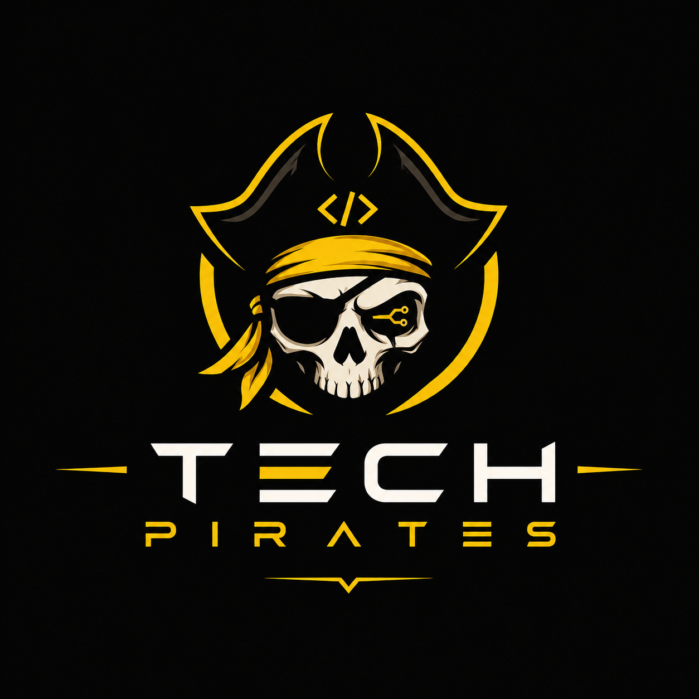

<div align="center">

# ⚡ IntelOps

### AI-Powered Incident Intelligence & SRE Command Centre

*Built for engineering teams that need fast, structured, and intelligent incident response — from first alert to postmortem.*

---

[](https://intelops-wpyz.onrender.com)
[](https://intelops-backend.onrender.com)
[](https://nodejs.org)
[](https://react.dev)
[](https://mongodb.com)
[](https://socket.io)
[](https://ai.google.dev)

</div>

---

## 🧭 What is IntelOps?

IntelOps is a production-grade **Site Reliability Engineering (SRE) Incident Management Platform** that gives engineering organisations a single, real-time command centre to detect, respond to, and learn from production incidents.

What makes it different from a simple issue tracker?

- **AI-first**: Every timeline update triggers an asynchronous AI pipeline that surfaces root causes and recommends next actions in real-time, via Socket.IO — no waiting, no page reloads.
- **Roles that make sense**: Four distinct, purpose-built dashboards. Admin, Team Lead, Responder, and Reporter each see *exactly* what they need and nothing they don't.
- **Full incident lifecycle**: From the moment a bug is reported to the moment an AI-generated postmortem is stored — the full arc is covered in one platform.
- **Premium, immersive UI**: Art Deco design system with Framer Motion animations, obsidian + gold aesthetics, and Marcellus + Josefin Sans typography.

---

## 🌐 Live Deployment

| Service | URL |
|---|---|
| **Frontend Platform** | [https://intelops-wpyz.onrender.com](https://intelops-wpyz.onrender.com) |
| **Backend REST API** | [https://intelops-backend.onrender.com](https://intelops-backend.onrender.com) |

> **Note for Judges**: The backend is hosted on Render's free tier and may take **10–20 seconds** to wake up from sleep on the first request. Refresh once if the login seems slow.

---

## 🔐 Demo Credentials

Four accounts are pre-seeded to let you explore each role's experience end-to-end.

### 👑 Admin — Command Centre
```
Email:    admin@intelops.com
Password: admin123
```
Full platform control. Create users, build squads, assign team leads, oversee all incidents across all projects, run infrastructure monitoring, and review the AI intelligence logs.

### 🎖️ Team Lead
```
Email:    saksham@intelops.com
Password: saksham123
```
Squad-level commander. Assigns incoming incidents to specific responders in the squad, monitors their progress, updates incident status, and triggers postmortem generation.

### 🛠️ Team Member / Responder
```
Email:    test@intelops.com
Password: test123
```
Frontline responder. Views incidents assigned to them, investigates the issue, and posts real-time timeline updates (which trigger the AI analysis pipeline).

### 🐛 Bugger / Reporter
```
Email:    rohan@intelops.com
Password: rohan123
```
Issue reporter. Submits structured bug reports tied to specific projects and tracks their resolution status.

---

## ✨ Core Features

### 🤖 AI Intelligence Engine
- **Root Cause Detection** — triggered after every timeline update, streamed via Socket.IO
- **Next Action Recommendations** — AI-suggested remediation steps delivered in real-time
- **Automated Postmortem Generation** — when an incident is resolved, a full structured postmortem is generated and persisted automatically
- **Fallback Architecture** — Gemini 2.5 Flash → Mistral (automatic failover if any LLM is rate-limited)

### 📡 Real-Time Everything
- Socket.IO rooms per-user and per-incident
- Notifications for assignments, status changes, and AI results
- Dashboard stats and incident lists update live without any page refresh

### 🛡️ Role-Based Access Control (RBAC)
- Every API route is guarded by `protect` (JWT) + `allowRoles` middleware
- Every frontend route has a `ProtectedRoute` guard
- UI elements are conditionally rendered per role — responders never see admin panels

### 🏗️ Squad & Team Management
- Admins create named squads and assign users to them
- Admins can appoint a Team Lead for any squad
- Incidents auto-route to the correct Team Lead based on project ownership

### 📋 Full Incident Lifecycle
```
Reporter submits bug
  └─→ Auto-assigned to project's Team Lead
        └─→ Lead assigns responders from their squad
              └─→ Responders post timeline updates
                    └─→ AI: root cause + next actions stream in (~3s)
                          └─→ Lead marks incident as resolved
                                └─→ AI: full postmortem generated (~8s)
```

---

## 🗂️ Repository Structure

```
IntelOps/
├── Frontend/          # React 19 + Vite SPA — Art Deco design system, role dashboards
│   ├── src/
│   │   ├── app/       # Router + ProtectedRoute RBAC guard
│   │   ├── features/  # One folder per domain (admin, auth, incidents, etc.)
│   │   ├── shared/    # DashboardLayout + Sidebar (role-aware nav config)
│   │   └── services/  # Axios instance with JWT interceptor
│   └── README.md      # 👉 Full Frontend documentation
│
└── Backend/           # Node.js + Express + MongoDB + Socket.IO + LangChain
    ├── src/
    │   ├── controllers/    # Business logic per domain
    │   ├── routes/         # REST API routes with RBAC middleware
    │   ├── models/         # Mongoose schemas (User, Incident, Group, etc.)
    │   ├── ai/             # LangChain pipeline — root cause, postmortem, suggestions
    │   ├── socket/         # Socket.IO room management + event emission
    │   ├── middlewares/     # protect (JWT), allowRoles (RBAC), validators
    │   └── utils/          # Token generation, notification helpers
    ├── docs/               # 👉 Full Backend documentation (see below)
    └── README.md           # 👉 Full Backend documentation
```

---

## 📚 Further Documentation

Go deeper into the technical implementation with the detailed docs in each sub-project:

| Document | Description |
|---|---|
| [Frontend README](./Frontend/README.md) | Full frontend architecture, folder breakdown, component map, design system tokens |
| [Backend README](./Backend/README.md) | API overview, RBAC architecture, AI pipeline, Socket.IO events |
| [API Reference](./Backend/docs/api-reference.md) | All REST endpoints, request/response schemas, access levels |
| [AI Features Guide](./Backend/docs/ai-features.md) | LangChain pipeline, prompt design, async delivery, frontend integration |
| [Architecture Docs](./Backend/docs/architecture.md) | Full system design, data flow, folder structure diagram |
| [Getting Started](./Backend/docs/getting-started.md) | Local setup, environment variables, first admin creation |

---

## 🛠️ Tech Stack Summary

| Layer | Technology |
|---|---|
| **Frontend Framework** | React 19 + Vite 8 |
| **Styling** | Tailwind CSS v4 + Custom Art Deco Design System |
| **State Management** | Redux Toolkit + React-Redux |
| **Routing** | React Router v7 (file-based RBAC guards) |
| **Animations** | Framer Motion + Lenis Smooth Scroll |
| **HTTP Client** | Axios (with JWT interceptor) |
| **Backend Framework** | Node.js 18+ + Express 5 |
| **Database** | MongoDB + Mongoose ODM |
| **Authentication** | JWT (Bearer token) |
| **Real-time** | Socket.IO (user rooms + incident rooms) |
| **AI Orchestration** | LangChain |
| **AI Models** | Gemini 2.5 Flash → Mistral (automatic fallback) |
| **Schema Validation** | Zod (via LangChain StructuredOutputParser) |

---

## 🚀 Running Locally

> Full setup details: [Backend/docs/getting-started.md](./Backend/docs/getting-started.md)

### 1. Clone
```bash
git clone https://github.com/OmPrakash-X/IntelOps.git
cd IntelOps
```

### 2. Backend
```bash
cd Backend
npm install
```

Create `Backend/.env`:
```env
PORT=5000
MONGO_URI=your_mongodb_connection_string
JWT_SECRET=your_jwt_secret
CLIENT_URL=http://localhost:5173
GEMINI_API_KEY=your_gemini_api_key
MISTRAL_API_KEY=your_mistral_api_key
```

```bash
npm run dev          # Start server on :5000
npm run create-admin # Seed initial admin user (first time only)
```

### 3. Frontend
```bash
cd ../Frontend
npm install
```

Create `Frontend/.env`:
```env
VITE_API_URL=http://localhost:5000/api
```

```bash
npm run dev   # Start on http://localhost:5173
```

---

<div align="center">



**Built with ❤️ by Team Tech Pirates for Sheryians Coding School Hackathon**

*Go explore the platform and break things that's what it's designed to track.*

</div>
